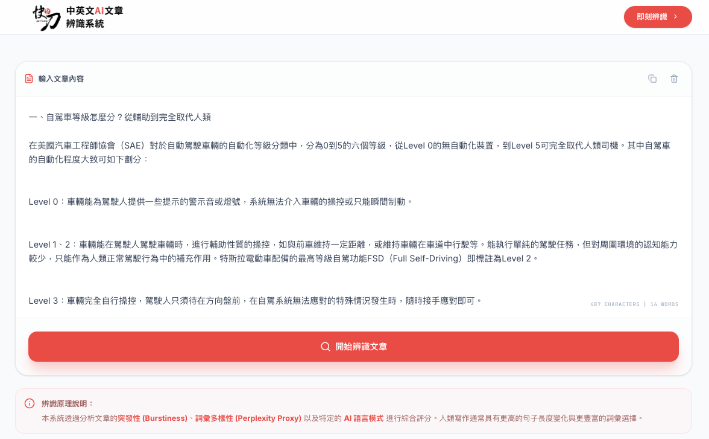
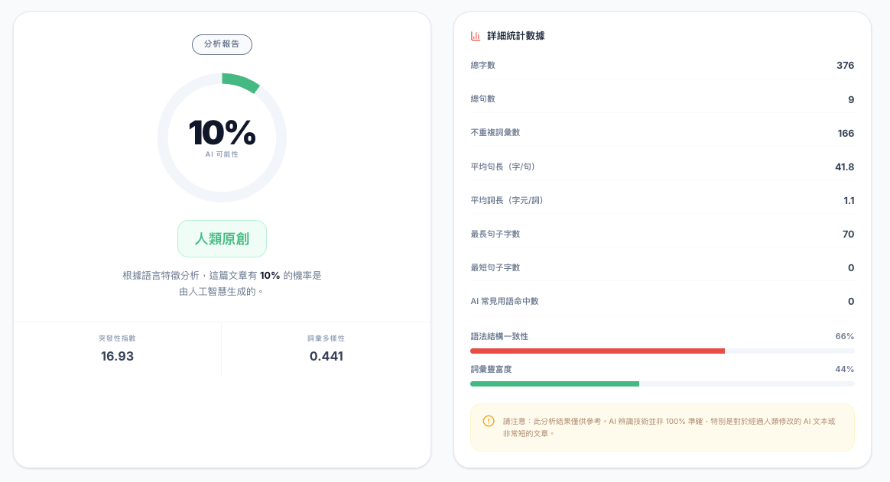
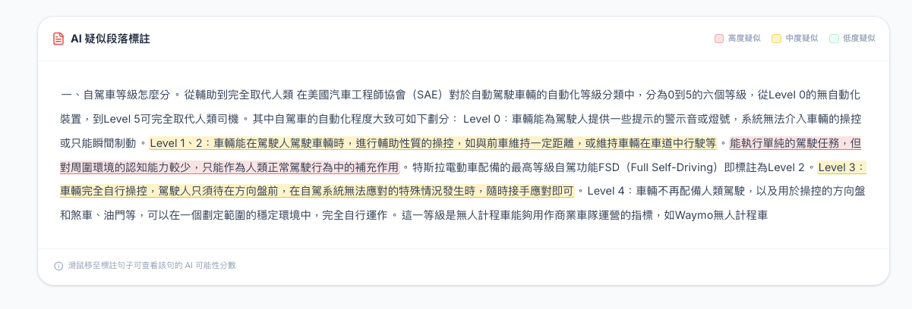

# 快刀中英文AI文章辨識系統（教學展示版 Demo）

> **⚠️ 教學展示用途聲明：本專案為教學展示與概念驗證用途（Demo），並非正式上線產品。所有功能、介面與分析結果均為展示教學之用，不具備正式產品之完整性與準確性，不應作為任何正式判定依據。**

> **智慧創新大賽參賽作品** — [Best AI Awards 2025](https://www.bestaiawards.com.tw/)

線上體驗：[https://ai.ppvs.org/](https://ai.ppvs.org/)

## 產品簡介（教學展示版）

> 📌 **注意：本系統為教學展示版本（Demo），旨在演示 AI 文章辨識的技術概念與流程，並非正式商用產品。展示版中的所有功能皆為概念驗證性質，辨識結果僅供學習與研究參考，不代表正式產品之實際效能與準確度。**

「快刀中英文AI文章辨識系統（教學展示版）」是一款基於快刀核心技術概念所開發的**教學展示應用**，透過對文本語言特徵（句子結構、語法、用詞、語意脈絡等）的分析，展示如何辨識由 GPT-5、Gemini 3、Claude 3 等主流 AI 語言模型所生成的文章，並演示翻譯工具產出文本的識別流程。本展示版旨在呈現文本分析與來源辨識的技術原理，供教學與研究用途參考。

## 系統畫面

> 以下截圖為教學展示版本的操作介面，實際正式產品之功能與介面可能有所不同。

### 1. 文章輸入介面



使用者可將待辨識的文章貼入輸入框中，系統提供字數與詞數即時統計。點擊「開始辨識文章」按鈕即可啟動分析流程。下方附有辨識原理說明，包含突發性（Burstiness）、詞彙多樣性（Perplexity Proxy）及 AI 語言模式等核心分析指標。

### 2. 分析報告與詳細統計



分析完成後，左側以環形圖呈現 AI 可能性百分比與判定結果（如「人類原創」），並顯示突發性指數與詞彙多樣性數值。右側提供詳細統計數據，包含總字數、總句數、不重複詞彙數、平均句長、平均詞長、最長/最短句子字數、AI 常見用語命中數，以及語法結構一致性與詞彙豐富度的視覺化進度條。

### 3. AI 疑似段落標註



系統將原文逐句進行 AI 可能性評分，並以三級顏色標註呈現：紅色為高度疑似 AI 生成、黃色為中度疑似、無標記為低度疑似。滑鼠移至標註句子上方可查看該句的 AI 可能性分數，協助使用者精確定位疑似 AI 生成的段落。

## 核心技術

> 📌 **本展示版採用簡化之演算法實作，用以說明 AI 辨識的基本原理與方法論，並不代表正式產品的完整技術實現。**

- **突發性分析 (Burstiness)** — 量測句子長度的變異程度，人類寫作通常具有較高的句長波動
- **詞彙多樣性 (Perplexity Proxy)** — 評估用詞豐富度，AI 生成文本往往呈現較均勻的詞彙分佈
- **AI 語言模式偵測** — 辨識 AI 常見的句型結構與用語習慣
- **中英文雙語支援** — 同時適用於中文與英文文章辨識

## 產品特色

> 📌 **以下特色描述為展示版所呈現之功能概念，正式產品規格請洽開發團隊。**

- 採用快刀專利核心技術
- 精準辨識主流 AI 模型生成內容（GPT-5、Gemini 3、Claude 3）
- 可識別翻譯工具產出的文本
- 視覺化分析報告，直觀呈現辨識結果
- AI 疑似段落逐句標註，精確定位可疑內容

## 本地開發

> 📌 **本專案為教學展示用途，程式碼僅供學習參考，不建議直接用於正式生產環境。**

**環境需求：** Node.js 18+

```bash
npm install
npm run dev
```

開啟瀏覽器前往 `http://localhost:3000` 即可使用。

## 建置部署

```bash
npm run build
```

產出的靜態檔案位於 `dist/` 目錄，可部署至任何靜態網站託管服務。

## 開發團隊

**雲書苑教育科技有限公司**

- 官網：[ai.ppvs.org](https://ai.ppvs.org/)
- Email：talk@ppvs.org
- 電話：(02) 2823-0833
- LINE 諮詢：@ppvs
- 數位學習精進方案產品序號：11222-077

## 免責聲明

本專案為**教學展示與概念驗證用途（Demo）**，並非正式發佈之商用產品。本系統之分析結果僅供學習、研究與參考，不保證其準確性或完整性，亦不應作為學術誠信判定、法律舉證或任何正式決策之依據。使用者應自行評估並承擔使用本系統所產生之風險。如需正式版本之 AI 文章辨識服務，請洽開發團隊。

## 授權

版權所有 © 2026 雲書苑教育科技有限公司
